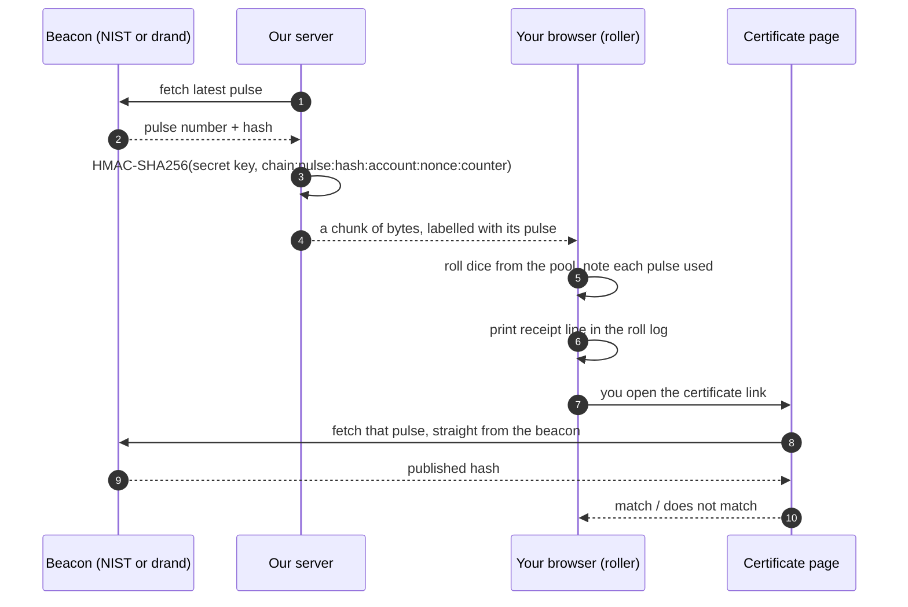

# Randomness

[Handbook](../README.md) · [Principles](principles.md) · [Coding standards](coding-standards.md) · **Randomness** · [Testing](testing.md) · [Performance](performance.md) · [Open source](open-source.md) · [Glossary](glossary.md)

Where the dice come from, in plain English. The exact formats live in [roll-verification-spec](https://github.com/dnddiceroller/roll-verification-spec/blob/main/SPEC.md). If this page and the spec ever disagree, the spec wins and this page has a bug.

## Three sources

The picker under the roller offers three. Each one falls back to the next, so a roll never waits.

| Source | Where the dice come from | Falls back to |
| --- | --- | --- |
| **NIST Beacon** (default) | The NIST Randomness Beacon, chain 2. A new pulse every 60 seconds. | drand, then your device |
| **drand Beacon** | The drand network, run by the League of Entropy. A new round every 30 seconds. | NIST, then your device |
| **Secure Enclave** | Your device's own cryptographic generator, `crypto.getRandomValues`. Instant and offline. | nothing below it |

### What a beacon is

A randomness beacon publishes a fresh random value on a fixed clock, and keeps every past value at a public address forever. Nobody can know a value before it is issued. Anyone can look one up afterwards.

That is the whole point: a beacon gives the roll a public timestamp nobody could have picked in advance.

### Why these two

A source qualifies only if anyone can check it without asking us and without trusting us. Good random bytes are not enough; there has to be a public record to point at. NIST and drand both keep one.

drand is there because a single beacon can go dark. In August 2026 NIST produced no pulse for more than a day, and every beacon roll fell back to the device. drand is a threshold signature from many independent organisations, so the two fail for different reasons. A second endpoint at the same organisation would not have helped.

The order stays NIST first, drand second. The order is a promise, and changing it is a decision made out loud, not a side effect.

### Device randomness

Your browser's `crypto.getRandomValues` is a cryptographic generator. It is better than JavaScript's built-in `Math.random`, which is fast but not cryptographic. It has no public record, so device rolls get no receipt.

## From beacon to dice



1. The server fetches a beacon record and mixes it with a secret key and a per-request nonce using HMAC-SHA256. A counter stretches the output to as many bytes as needed.
2. Your browser keeps those bytes in a pool. The pool is a queue of chunks, and each chunk remembers which pulse it came from.
3. Each die takes six bytes from the pool. The roller notes every pulse those bytes came from.
4. When the roll finishes, the roll log prints a receipt naming those pulses.
5. If the pool runs dry or the beacons are unreachable, the rest of the roll uses your device, and the receipt ends in `+ device`.

## What a receipt proves

A receipt line names the beacon record, the first 12 hex digits of its hash, and a **certificate** link, for example:

```
https://www.dnddiceroller.com/certificate?src=nist-beacon&chain=2&pulse=1966282&hash=<outputValue>
```

The certificate page fetches that record from the beacon itself, in your browser, and says **match** or **does not match**. It also draws a QR code of the beacon's own URL, so a player at the table can check on a phone without going through our site.

**A match proves:**

- The record is genuine. The beacon holds that hash for that pulse.
- The record existed at a fixed public moment, so nobody chose your roll's input in advance.

**A match does not prove:**

- The number you rolled. The key and nonce are secret on purpose. If the derivation used only public inputs, anyone watching the beacon could compute every roll before it happened. The trade: unpredictable to outsiders, and therefore not recomputable by outsiders either.
- Anything about device rolls. No public record, no receipt.
- That the certificate comes from us. It signs nothing. It is a page that reads its own URL and asks the beacon.

## Why a receipt can name two records

A big Roll All can use bytes from the end of one pulse and the start of the next. Or NIST can fail mid-roll and drand can finish it. Both records were really used, so both are named. That is correct, not a bug.

## Check it yourself

- In the browser: open the certificate link from your roll log.
- In a terminal: [verify-receipt.mjs](https://github.com/dnddiceroller/examples) fetches the record and compares the hash.
- By hand: `https://beacon.nist.gov/beacon/2.0/chain/2/pulse/<pulse>` and compare `outputValue`.
- How a hash becomes a fair die face, with a public toy key: [derive-roll.mjs](https://github.com/dnddiceroller/examples).

Neither the certificate page nor the example script checks the beacon's own signature. Both trust HTTPS to the beacon. NIST and drand publish what you need to check signatures yourself.

## The rules that keep receipts honest

- `markBlock()` and `blockReceipt()` run in one synchronous block, so nothing else on the page can slip draws into a roll's receipt.
- The pool never flattens into one buffer with one label.
- Decorative randomness (sound timing) never draws from the roll pool.
- Nothing about a roll is stored on our servers. Copy the certificate link if you want to keep it.

More in [Coding standards](coding-standards.md). Terms in the [Glossary](glossary.md).
