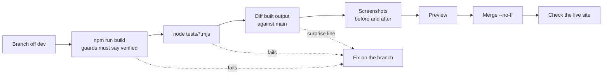

# Testing

[Handbook](../README.md) · [Principles](principles.md) · [Coding standards](coding-standards.md) · [Randomness](randomness.md) · **Testing** · [Performance](performance.md) · [Open source](open-source.md) · [Glossary](glossary.md)

How a change gets checked before it reaches anyone.



## 1. The build is the first test

```sh
npm run build
```

Read the `verified:` lines at the end. The build stops, rather than warns, when:

- two source files would land on the same URL
- a canonical tag or sitemap entry points at an address that redirects
- a colour is written outside a theme file

If a change adds a page, the canonical count goes up by one. If it doesn't, find out why.

## 2. Plain Node tests, no runner

Tests are plain `.mjs` scripts. No framework, no dependencies.

```sh
node tests/<file>.mjs
```

How they are written:

- **Test the bytes the browser gets.** A client test loads the real script file into a Node `vm` against the smallest fake DOM it will run on, not a copy of its logic.
- **Drive time by hand.** Timers advance on command, so a three-minute cycle takes no time and never races.
- **Use the real schema.** A server test runs the real endpoint against `node:sqlite`, with the real migrations applied.
- **Read the source of truth, don't copy it.** A test once named the schema files it checked. They went stale, and it passed for a month against tables production did not have. Now it reads the published list.
- **Check what would hurt.** Bad input is refused. Everything printed is escaped. Every user link carries `rel="ugc nofollow"`.

The public repos run on Node's built-in runner:

```sh
node --test
```

`dice-probability-tools` checks its exact keep/drop maths against brute-force enumeration.

## 3. Diff the output, not just the source

Build `main` beside your branch and compare the built folders. Account for every changed line.

```sh
diff -rq base/dist branch/dist
```

A footer link on fourteen pages reduces to **one** distinct line repeated fourteen times. If it reduces to more than you can explain, you changed something you did not mean to. The front page stays byte-identical unless the front page is the job. To prove a change shipped, grep for it in the built output.

## 4. Look at it

Screenshots before and after, for every visual change. Not reasoning about CSS. Check either side of the 700px and 1100px breakpoints.

```sh
"/Applications/Google Chrome.app/Contents/MacOS/Google Chrome" --headless=new --disable-gpu \
  --hide-scrollbars --window-size=1280,8000 --screenshot=after.png "http://localhost:8788/"
```

Two traps that have fooled us:

- **Headless Chrome will not go below about 500px wide.** Ask for 420 and you get a 500px page cropped to 420, which looks exactly like an overflow bug. Measure the real viewport width inside the page before believing a narrow screenshot.
- **A plain static server may not serve extensionless URLs.** `/books` can 404 locally and work live. Use a server that matches production, or request the `.html` file, before calling it a bug.

## 5. CI

CI runs on `main` and on merge requests. It builds the site, checks the expected pages exist, checks that no secret reached the build output, and exercises the failure cases on purpose. A guard that never fails proves nothing: we once had a green check guarding a rule that had never run once.

A red pipeline means the commit is wrong.

## 6. After it ships

```sh
for p in / /blog/ /this-does-not-exist; do
  curl -s -o /dev/null -w "$p %{http_code}\n" https://www.dnddiceroller.com$p
done
```

Expect 200, 200, 404. Anything else, revert the merge commit.

## 7. Say what you didn't check

If a test could not run because of the environment, say so. A green run you did not get is worse than a red one.

## The checklist

```
[ ] branch named for the one thing it does
[ ] started from up-to-date main
[ ] build passes; every guard says "verified"
[ ] diffed against main; every changed file is expected
[ ] previewed; screenshots taken
[ ] front page: nothing changed except what the branch is for
[ ] no secrets, no personal files, no node_modules in the diff
[ ] merged main into the branch first; build still passes
[ ] merged with --no-ff; watched the deploy go green
[ ] live site checked
[ ] branch deleted, local and remote
[ ] log written
```

See also: [Coding standards](coding-standards.md), [Performance](performance.md).
